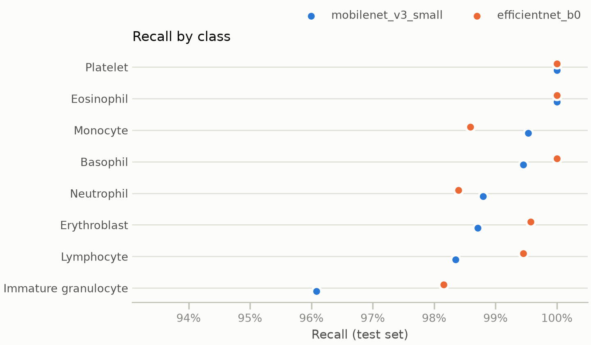
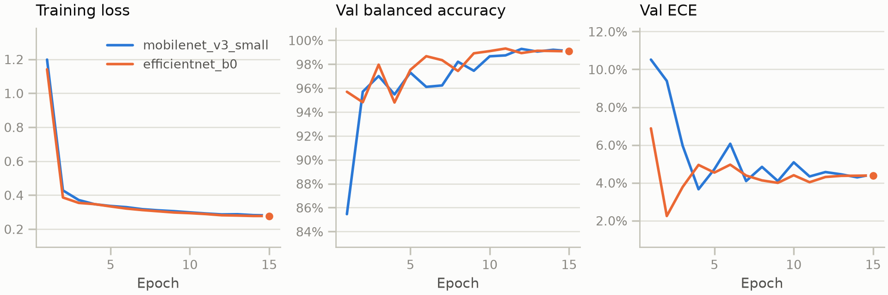
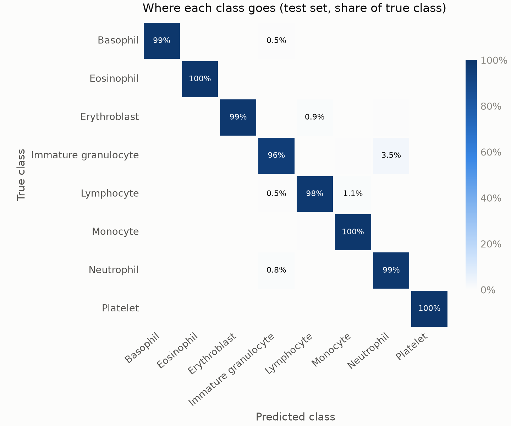
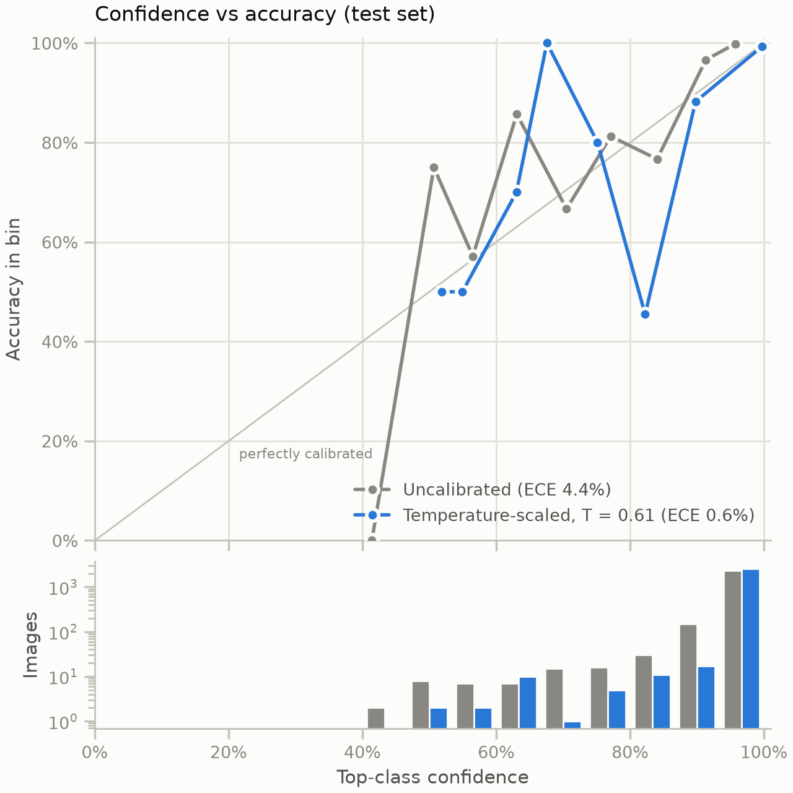
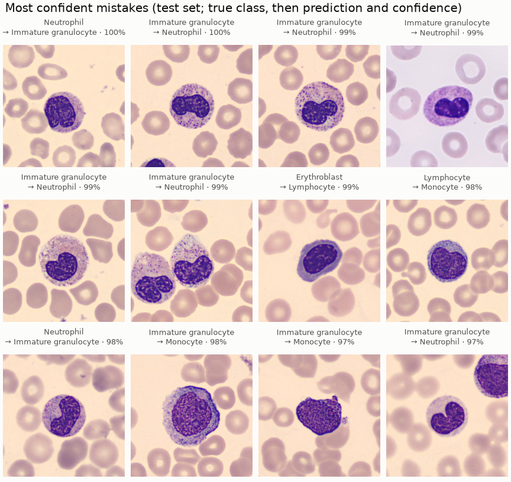
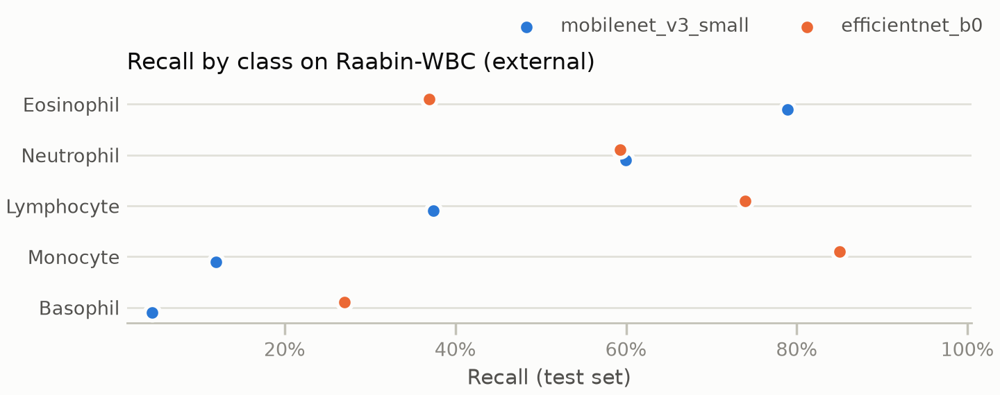
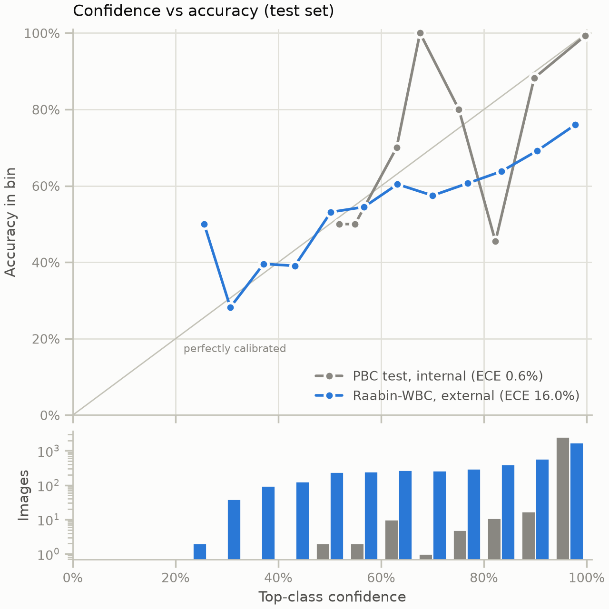

# peripheral-blood-cell-classification

Peripheral blood cell classification, from a PyTorch prototype on the desktop
to C++ inference on an edge device (Raspberry Pi).

- **Phase 1:** fine-tune a pretrained CNN on 8 cell classes; report balanced
  accuracy, macro-F1, per-class recall, confusion matrix and calibration
  (ECE, temperature scaling).
- **Phase 2:** export to ONNX, quantize to INT8, and run it with the ONNX
  Runtime C++ API on a Raspberry Pi, comparing accuracy and latency
  against the desktop.

Work is tracked in GitHub Issues under the Phase 1 and Phase 2 milestones.

## Quick start

Needs [uv](https://docs.astral.sh/uv/). It installs Python 3.12 from
`.python-version` if missing.

```bash
uv sync --extra cpu --extra export --extra viz   # cu126 instead of cpu for an NVIDIA GPU
uv run pytest                        # synthetic-data tests, no download

# after unzipping the dataset into data/ (see data/README.md)
uv run bloodcell-split
uv run bloodcell-train --arch mobilenet_v3_small --epochs 15
uv run bloodcell-eval runs/<run>/best.pt
uv run bloodcell-export runs/<run>/best.pt   # -> best.onnx + best.json
uv run bloodcell-plot runs/<run>             # figures, see docs/figures/STYLE.md
```

Edge build: [edge/README.md](edge/README.md).

## Results

Two small ImageNet-pretrained CNNs, fine-tuned for 15 epochs with the same
recipe: AdamW, one-cycle learning rate peaking at 1e-3, batch 64, label
smoothing 0.05, seed 0. They were trained with CUDA on a laptop GPU. The
checkpoint and the temperature are both chosen on the validation split. The
test split (2,562 images, stratified, deduplicated) is scored once.

| Model | Params | Test acc. | Balanced acc. | Macro-F1 | ECE, raw → T-scaled |
|---|--:|--:|--:|--:|--:|
| mobilenet_v3_small | 1.5 M | 98.8% | 98.9% | 98.9% | 4.4% → 0.6% |
| efficientnet_b0 | 4.0 M | 99.2% | 99.3% | 99.3% | 4.3% → 0.4% |
| *Acevedo et al. 2019, VGG-16 / Inception v3* | | *96% / 95%* | | | |

The paper's row is a reference point, not a like-for-like comparison. It
used its own split, and the duplicates were not removed.

- **The two models are effectively tied.** EfficientNet-B0 makes 21 errors
  on the test set and MobileNetV3-Small makes 31. With one seed on one
  split, that gap is within run-to-run noise. MobileNetV3-Small has under
  half the parameters, so it is the candidate for the Raspberry Pi.
- **Most errors are immature granulocytes (IG).** For both models, most
  mistakes are IG confused with neutrophils. IG covers several stages of
  neutrophil maturation, so this boundary is genuinely fuzzy.
- **Both models are underconfident before calibration.** The fitted
  temperatures are below 1 (0.61 and 0.64), partly because label smoothing
  trains the model never to aim for 100%. Temperature scaling doesn't
  change any prediction, and it cuts ECE to under 1%.

<picture>
  <source media="(prefers-color-scheme: dark)" srcset="docs/figures/per-class-recall-dark.png">
  
</picture>

<picture>
  <source media="(prefers-color-scheme: dark)" srcset="docs/figures/training-curves-dark.png">
  
</picture>

MobileNetV3-Small in detail:

<picture>
  <source media="(prefers-color-scheme: dark)" srcset="docs/figures/mobilenet_v3_small/confusion-matrix-dark.png">
  
</picture>

<picture>
  <source media="(prefers-color-scheme: dark)" srcset="docs/figures/mobilenet_v3_small/reliability-dark.png">
  
</picture>

### Error analysis

Most mistakes sit on one boundary. The PBC file names carry the dataset's
sub-types, and they show where the errors come from:

| Model | Errors | Metamyelocyte (IG) → neutrophil | Band neutrophil → IG | Everything else |
|---|--:|--:|--:|--:|
| mobilenet_v3_small | 31 | 14 of 148 | 4 of 254 | 13 |
| efficientnet_b0 | 21 | 5 of 148 | 8 of 254 | 8 |

A metamyelocyte and a band neutrophil are neighbouring stages of neutrophil
maturation, told apart by how deeply the nucleus is indented. PBC puts the
class boundary between them, so the models are asked to draw a line that
morphologists also find hard to draw. The two models place it differently:
MobileNet tends to call metamyelocytes neutrophils, and EfficientNet tends
to call band neutrophils IG. No segmented neutrophil was misclassified by
either model. 12 test images are wrong for both.

<picture>
  <source media="(prefers-color-scheme: dark)" srcset="docs/figures/mobilenet_v3_small/misclassified-dark.png">
  
</picture>

The worst mistakes are made with 97–100% confidence, so calibration doesn't
flag them: it is right on average, not image by image. A review threshold
still helps. Sending every image below 90% confidence to a person would
catch 14 of MobileNet's 31 errors. It would flag 41 images in all (1.6% of
the test set), 27 of them correct.

### External validation

Everything above is an internal score: the split is image-level, and every
image comes from one lab and one analyser. To see what survives a change
of lab, the same checkpoints were scored, without retraining, on
[Raabin-WBC](https://www.nature.com/articles/s41598-021-04426-x) Test-A:
4,339 cells labelled by two experts, from a lab in Iran, with a different
microscope, camera and stain. It has five of PBC's eight classes. Setup:
[data/README.md](data/README.md).

| Model | PBC test | Raabin, forced choice of 5 | Raabin, all 8 classes | Raabin ECE, raw → T-scaled |
|---|--:|--:|--:|--:|
| mobilenet_v3_small | 98.9% | 53.0% | 38.5% | 8.2% → 16.0% |
| efficientnet_b0 | 99.3% | 63.5% | 56.5% | 12.1% → 19.7% |

Balanced accuracy; chance is 20%. "Forced choice" picks among the five
classes Raabin has, which isolates the change of lab. "All 8 classes" is
the model as it would run, where calling a Raabin cell an immature
granulocyte, erythroblast or platelet counts as wrong. MobileNet does that
for 25% of the cells, and EfficientNet for 12%.

- **The internal score says almost nothing about another lab.** Both models
  lose 40–60 points of balanced accuracy.
- **The internal tie hides a real difference.** EfficientNet-B0 holds up far
  better (56.5% against 38.5%), even though the two models are within ten
  test images of each other on PBC. This is one seed per model, but the gap
  is much larger than anything seen internally.
- **The errors look like a stain shortcut.** Raabin's stain is pinker, and
  MobileNet calls 54% of Raabin's monocytes and 24% of its neutrophils
  eosinophils, the cell type identified by pink-orange granules. The images
  also differ in scale (575 px crops at a different magnification, against
  PBC's 360 px), and both are resized to 224 px.
- **Calibration doesn't transfer.** The temperature fitted on PBC makes the
  models more confident, which is wrong once accuracy falls: ECE on Raabin
  roughly doubles. A confidence threshold tuned on PBC can't be trusted on
  another lab's images.

<picture>
  <source media="(prefers-color-scheme: dark)" srcset="docs/figures/external-recall-dark.png">
  
</picture>

<picture>
  <source media="(prefers-color-scheme: dark)" srcset="docs/figures/mobilenet_v3_small/external-reliability-dark.png">
  
</picture>

Caveats: Test-A was imaged on the same equipment as Raabin's own training
set. Test-B, from a different microscope, isn't in the copy we used. The
mapping from Raabin's numeric labels to class names is inferred from the
class counts in its paper and checked by eye.

## Dataset

Acevedo A, Merino A, Alférez S, Molina Á, Boldú L, Rodellar J. *A dataset of
microscopic peripheral blood cell images for development of automatic
recognition systems.* Data in Brief 30 (2020) 105474.
Mendeley Data, DOI [10.17632/snkd93bnjr.1](https://doi.org/10.17632/snkd93bnjr.1),
licensed [CC BY 4.0](https://creativecommons.org/licenses/by/4.0/). 17,092
images of normal cells in 8 classes, acquired with a CellaVision DM96 at the
Hospital Clinic of Barcelona.

Before splitting, 16 byte-identical duplicates are removed, plus both copies
of one image labelled as both eosinophil and neutrophil, leaving 17,074
images ([ADR 0004](docs/decisions/0004-deduplicate-before-splitting.md)).

This repository does not redistribute the images. `data/splits.csv` lists
the dataset's file names and class labels unchanged, plus the split each
image was assigned to.

**Limitation:** the dataset has no patient or smear IDs, so the split is
image-level and internal test scores are likely optimistic. See External
validation for how much they drop on another lab's images.

## Development

See [CONTRIBUTING.md](CONTRIBUTING.md) for the workflow and checks. The
project is built with Claude Code as a coding assistant. The design,
validation and review are mine, and every change goes through tests and CI
before it is merged.

## License

Code: [BSD-3-Clause](LICENSE). The dataset keeps its own CC BY 4.0 license.
Models are fine-tuned from torchvision's ImageNet-pretrained weights, which
come with their own terms; see the
[torchvision model docs](https://docs.pytorch.org/vision/stable/models.html).
